# 🛍️ OorFeel - Your Trusted Online Shopping Companion

[](https://flutter.dev/)
[](https://dart.dev/)
[](LICENSE)
[](https://flutter.dev/docs/deployment)

<div align="center">
  
  <h3>Modern E-commerce Mobile Application</h3>
</div>

## 📱 Download & Links

<div align="center">

[](https://play.google.com/store/apps/details?id=com.oorfeel.oorfeel)
[](https://oorfeel.com/)

</div>

## 📖 Table of Contents

- [About](#-about)
- [Features](#-features)
- [Screenshots](#-screenshots)
- [Tech Stack](#-tech-stack)
- [Architecture](#-architecture)
- [Getting Started](#-getting-started)
- [Project Structure](#-project-structure)
- [API Integration](#-api-integration)
- [State Management](#-state-management)
- [Localization](#-localization)
- [Testing](#-testing)
- [Deployment](#-deployment)
- [Contributing](#-contributing)
- [Support](#-support)
- [License](#-license)

## 🎯 About

**OorFeel** is a comprehensive e-commerce mobile application designed to provide users with a seamless, secure, and modern shopping experience. Built with Flutter, the app offers a robust platform for online shopping with advanced features like real-time notifications, multi-language support, and secure payment processing.

### Key Highlights

- 🛒 **Complete E-commerce Solution**: Product browsing, cart management, and order tracking
- 🔐 **Secure Authentication**: Login, registration, and password recovery
- 📱 **Cross-Platform**: Available on Android, iOS, and Web
- 🌍 **Multi-Language Support**: Arabic and English localization
- 🔔 **Push Notifications**: Real-time order updates and promotional notifications
- 💳 **Secure Payments**: Integrated payment processing
- 📊 **Analytics & Tracking**: Order history and user analytics

## ✨ Features

### Core Features
- **User Authentication & Authorization**
  - Secure login/register system
  - Password recovery functionality
  - Profile management
  - Session management

- **Product Management**
  - Product catalog with categories
  - Advanced search and filtering
  - Product details with images
  - Wishlist functionality

- **Shopping Cart & Checkout**
  - Add/remove items from cart
  - Quantity management
  - Secure checkout process
  - Multiple payment options

- **Order Management**
  - Order tracking
  - Order history
  - Order status updates
  - Invoice generation

- **Notifications System**
  - Push notifications
  - In-app notifications
  - Notification preferences
  - Order status alerts

### Advanced Features
- **Multi-language Support**: Arabic and English
- **Offline Capability**: Cached data for offline browsing
- **Image Optimization**: Efficient image loading and caching
- **Responsive Design**: Adaptive UI for different screen sizes
- **Performance Optimization**: Fast loading and smooth animations

## 📸 Screenshots

### Authentication Flow
| Splash Screen | Login | Register | Forgot Password |
|---------------|-------|----------|-----------------|
| 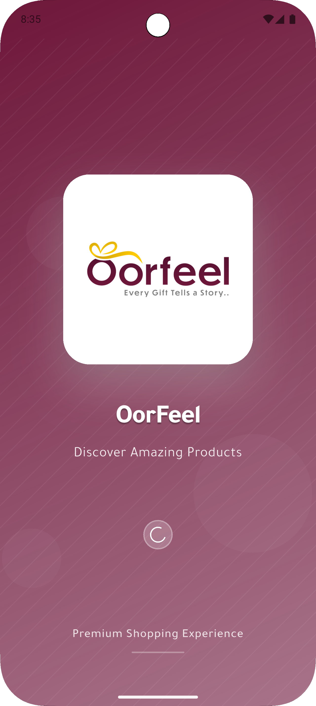 | 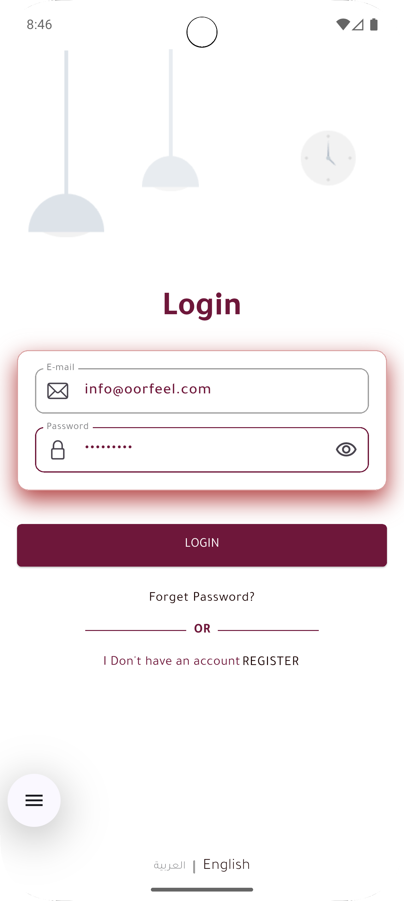 | 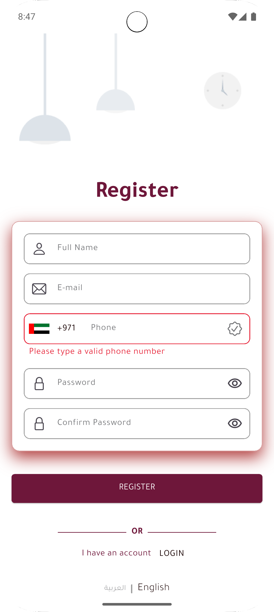 | 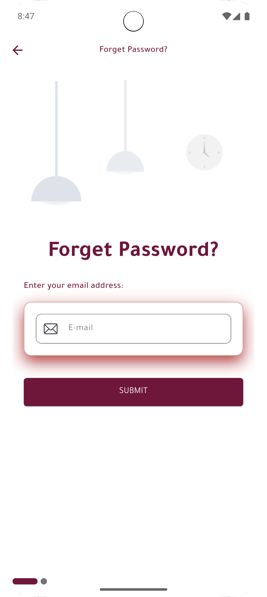 |

### Main App Flow
| Home | Categories | Product Details | Search |
|------|------------|----------------|--------|
| 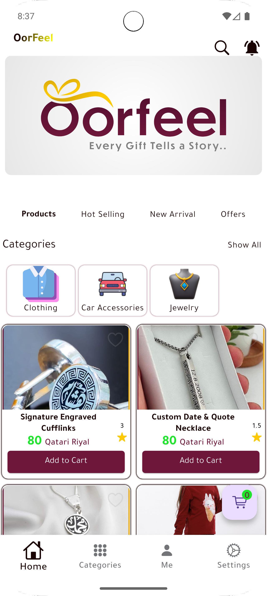 | 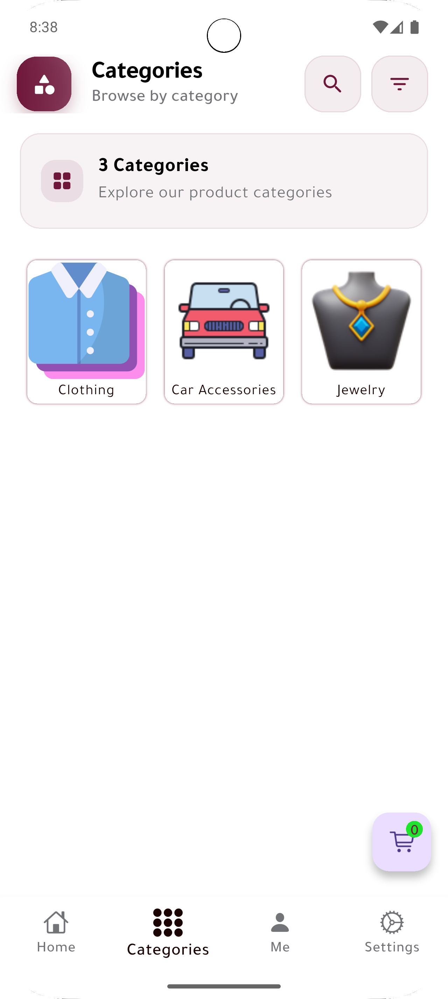 | 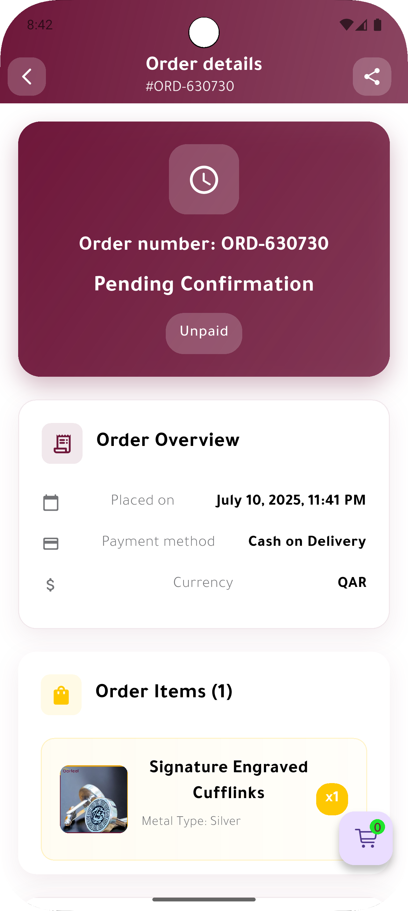 | 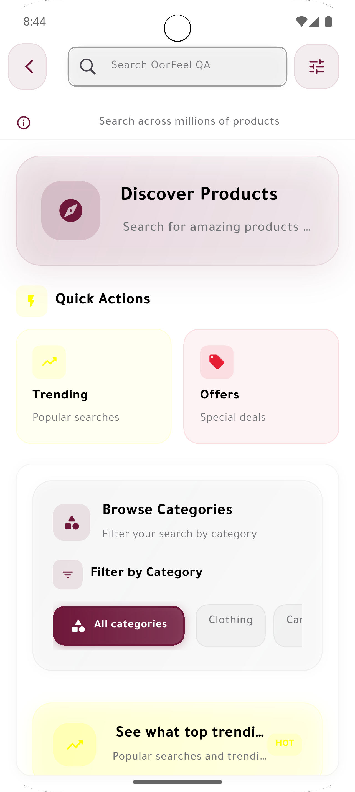 |

### Shopping Experience
| Cart | Checkout | My Orders | Category Filter |
|------|----------|-----------|-----------------|
| 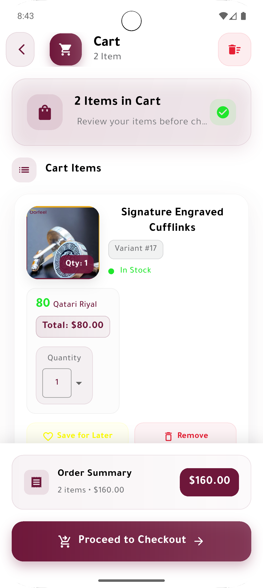 | 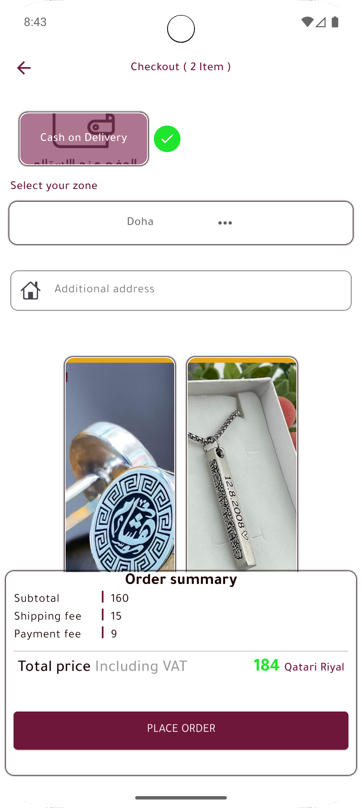 | 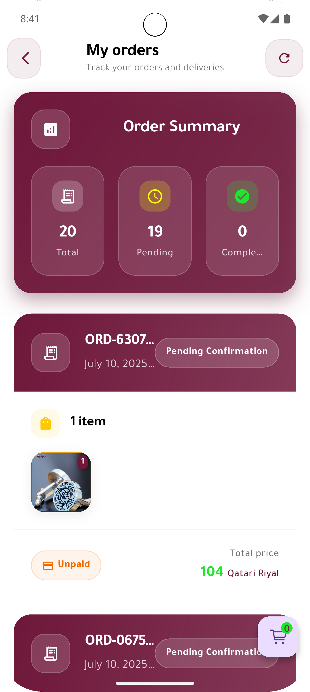 | 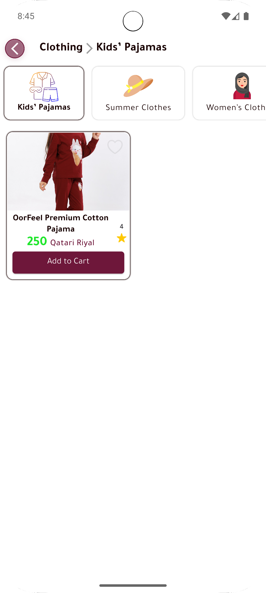 |

### User Interface
| Profile | Settings | Notifications | Notification Settings |
|---------|----------|---------------|---------------------|
| 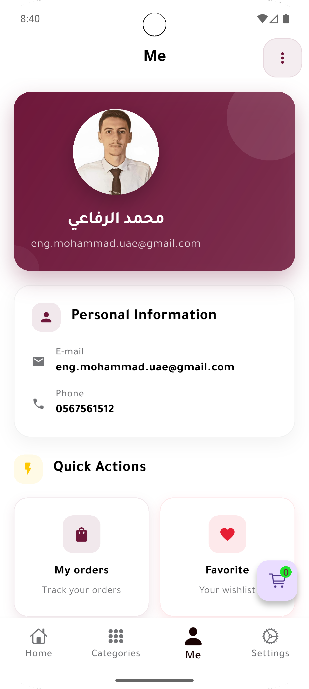 | 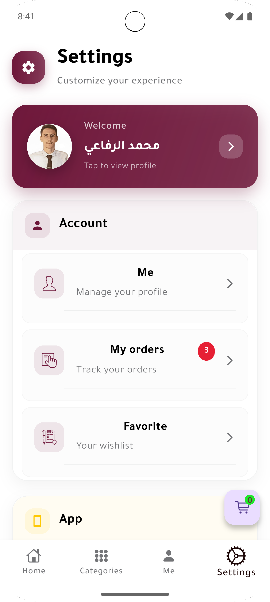 | 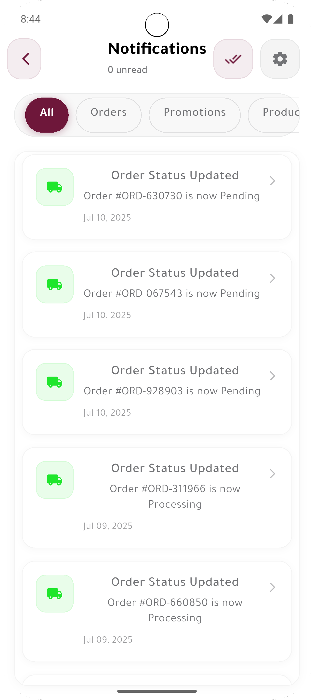 |  |

## 🛠️ Tech Stack

### Frontend
- **Framework**: [Flutter](https://flutter.dev/) 3.16.0
- **Language**: [Dart](https://dart.dev/) 3.2.0
- **State Management**: [flutter_bloc](https://pub.dev/packages/flutter_bloc)
- **Dependency Injection**: [get_it](https://pub.dev/packages/get_it) + [injectable](https://pub.dev/packages/injectable)

### Backend Integration
- **HTTP Client**: [Dio](https://pub.dev/packages/dio)
- **JSON Serialization**: [json_annotation](https://pub.dev/packages/json_annotation)
- **API Documentation**: RESTful APIs with comprehensive documentation

### UI/UX
- **Icons**: [flutter_svg](https://pub.dev/packages/flutter_svg)
- **Images**: [cached_network_image](https://pub.dev/packages/cached_network_image)
- **Image Viewer**: [photo_view](https://pub.dev/packages/photo_view)
- **Animations**: Flutter's built-in animation system

### Localization & Internationalization
- **Localization**: [easy_localization](https://pub.dev/packages/easy_localization)
- **Date/Time**: [intl](https://pub.dev/packages/intl)
- **Supported Languages**: Arabic (RTL), English (LTR)

### Utilities
- **Value Comparison**: [equatable](https://pub.dev/packages/equatable)
- **Notifications**: [fluttertoast](https://pub.dev/packages/fluttertoast)
- **Permissions**: [permission_handler](https://pub.dev/packages/permission_handler)
- **URL Launcher**: [url_launcher](https://pub.dev/packages/url_launcher)

## 🏗️ Architecture

The app follows a clean architecture pattern with clear separation of concerns:

```
lib/
├── di/                    # Dependency Injection
├── src/
│   ├── config/           # App configuration
│   ├── data/             # Data layer
│   │   ├── data_sources/ # Remote and local data sources
│   │   └── repositories/ # Repository implementations
│   ├── domain/           # Business logic layer
│   │   ├── models/       # Domain models
│   │   ├── repositories/ # Repository interfaces
│   │   └── usecases/     # Business use cases
│   ├── presentation/     # UI layer
│   │   ├── cubits/       # State management
│   │   ├── views/        # UI screens
│   │   └── widgets/      # Reusable widgets
│   ├── services/         # App services
│   └── utils/            # Utilities and helpers
```

### Design Patterns
- **BLoC Pattern**: For state management
- **Repository Pattern**: For data access
- **Dependency Injection**: For loose coupling
- **Clean Architecture**: For maintainability

## 🚀 Getting Started

### Prerequisites
- [Flutter](https://flutter.dev/docs/get-started/install) 3.16.0 or higher
- [Dart](https://dart.dev/get-dart) 3.2.0 or higher
- [Android Studio](https://developer.android.com/studio) or [VS Code](https://code.visualstudio.com/)
- [Git](https://git-scm.com/)

``

## 📁 Project Structure

```
oorfeel/
├── android/              # Android-specific files
├── ios/                  # iOS-specific files
├── lib/                  # Main Dart code
│   ├── di/              # Dependency injection
│   ├── src/
│   │   ├── config/      # App configuration
│   │   ├── data/        # Data layer
│   │   ├── domain/      # Business logic
│   │   ├── presentation/# UI layer
│   │   ├── services/    # App services
│   │   └── utils/       # Utilities
│   └── main.dart        # App entry point
├── assets/              # Static assets
│   ├── fonts/           # Custom fonts
│   ├── icons/           # SVG icons
│   ├── images/          # Images
│   ├── json/            # JSON files
│   └── translations/    # Localization files
├── test/                # Test files
└── pubspec.yaml         # Dependencies
```

## 🔌 API Integration

The app integrates with a RESTful API for:
- User authentication and management
- Product catalog and search
- Order processing and tracking
- Payment processing
- Notification services

### API Features
- **Authentication**: JWT token-based authentication
- **Caching**: Intelligent caching for offline support
- **Error Handling**: Comprehensive error handling and retry logic
- **Rate Limiting**: Proper rate limiting implementation
- **Security**: HTTPS with certificate pinning

## 📊 State Management

The app uses **BLoC (Business Logic Component)** pattern for state management:

- **AuthCubit**: Manages authentication state
- **CartCubit**: Handles shopping cart operations
- **ProductCubit**: Manages product data and filtering
- **OrderCubit**: Handles order management
- **NotificationCubit**: Manages notification states

## 🌍 Localization

The app supports multiple languages with RTL support:

### Supported Languages
- **Arabic** (RTL) - Primary language
- **English** (LTR) - Secondary language

### Adding New Languages
1. Add translation file in `assets/translations/`
2. Update `lib/src/config/languages/languages.dart`
3. Test RTL/LTR layouts

## 🧪 Testing

### Test Structure
```
test/
├── unit/           # Unit tests
├── widget/         # Widget tests
└── integration/    # Integration tests
```

## 🤝 Contributing

We welcome contributions! Please follow these steps:

### Contribution Guidelines
- Follow the existing code style
- Add tests for new features
- Update documentation as needed
- Ensure all tests pass

## 📞 Support

### Contact Information
- **Developer**: Mohammad AlRefaie
- **Email**: info@oorfeel.com , eng.mohammad.uae@gmail.com
- **Phone**: +971567561512 | +971567561512
- **Address**: Qatar - Doha | UAE - Dubai

### Links
- 🌐 **Website**: [https://oorfeel.com/](https://oorfeel.com/)
- 📱 **Google Play**: [https://play.google.com/store/apps/details?id=com.oorfeel.oorfeel](https://play.google.com/store/apps/details?id=com.oorfeel.oorfeel)

### Getting Help
- 📧 **Email Support**: eng.mohammad.uae@gmail.com
- 📱 **Phone Support**: +971567561512
- 🐛 **Report Issues**: Create an issue on GitHub

## 📄 License

This project is licensed under the MIT License - see the [LICENSE](LICENSE) file for details.

## 🙏 Acknowledgments

- Flutter team for the amazing framework
- All contributors and beta testers
- The open-source community for various packages used

---

<div align="center">
  <p>Made with ❤️ by <a href="https://oorfeel.com/">OorFeel Team</a></p>
  <p>⭐ Star this repository if you find it helpful!</p>
</div>